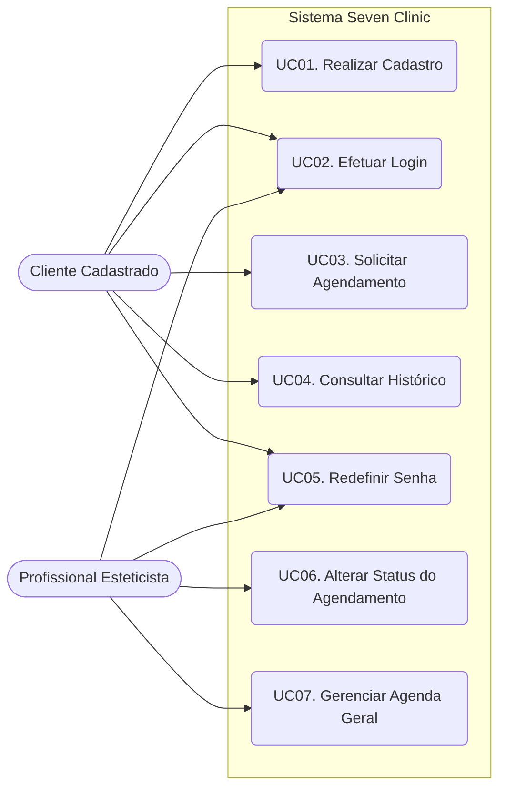
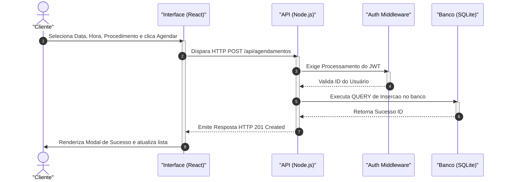
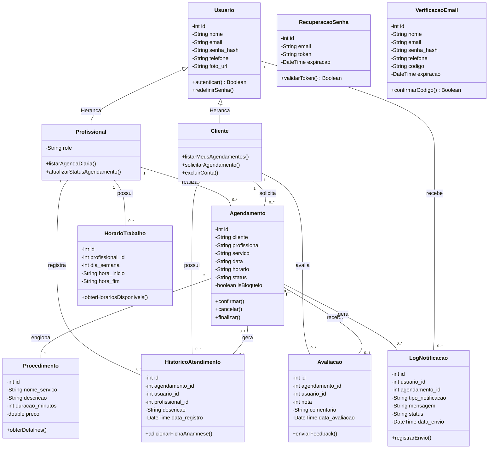
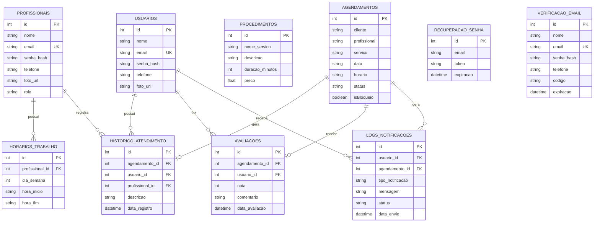

# TRABALHO DE CONCLUSÃO DE CURSO: SISTEMA SEVEN CLINIC

---

## 1. ELEMENTOS PRÉ-TEXTUAIS

*(Nesta seção devem constar as páginas formais de formatação ABNT: Capa, Folha de Rosto, Folha de Aprovação, Dedicatória, Agradecimentos, Epígrafe, Resumo na língua vernácula, Abstract (resumo em língua estrangeira), Lista de Ilustrações, Lista de Tabelas e Sumário. Por se tratar de um documento digital, estas páginas são representadas como marcadores de espaço estruturais).*

---

## 2. INTRODUÇÃO

O mercado de saúde, estética e beleza vem passando por transformações drásticas na última década. Com o aumento da concorrência e o refinamento do comportamento do consumidor, que agora exige comodidade, rapidez e eficiência no atendimento, clínicas e salões de beleza deparam-se com o desafio da digitalização de seus processos gerenciais. É neste cenário de transição tecnológica que se insere o **Seven Clinic**, uma aplicação web robusta, idealizada e desenvolvida para centralizar a gestão de agendamentos e otimizar o relacionamento entre as profissionais de estética e seus clientes.

O objetivo principal deste projeto é prover um ecossistema digital no qual métodos analógicos e manuais — tais como o uso de cadernos de papel, cartilhas físicas de agendamento e anotações isoladas efetuadas por meio de aplicativos de mensagens genéricos (como o WhatsApp) — sejam totalmente substituídos por uma plataforma centralizada, auditável e altamente disponível. 

Através desta aplicação, os clientes conquistam autonomia integral sobre o seu ciclo de atendimento: eles podem realizar seus próprios cadastros, observar o catálogo de serviços detalhado (com preços e durações estipuladas) e, por fim, escolher profissionais e horários que se adequem às suas agendas, de modo independente e inteligente. Em contrapartida, as profissionais e a administração da clínica beneficiam-se de um painel de controle (Dashboard) em tempo real, que mitiga o desgaste operacional, reduz o risco de erro humano (como a sobreposição de horários acidental) e fornece subsídios práticos para a gestão das fichas de anamnese, do fluxo de trabalho diário e do histórico financeiro atrelado aos procedimentos concluídos.

Este documento tem por finalidade detalhar toda a fundação arquitetural, o levantamento de requisitos intrínsecos e extrínsecos, as escolhas de infraestrutura tecnológica, e as modelagens lógicas e de dados que estruturam toda a aplicação Seven Clinic.

---

## 3. ANÁLISE DO SISTEMA ATUAL E JUSTIFICATIVA

Historicamente, o fluxo de operação da grande maioria dos estabelecimentos de estética locais ocorre de maneira manual e altamente reativa. Quando um cliente deseja ser atendido, ele comumente entra em contato via telefone ou aplicativo de mensagens. Este ato exige que haja, do outro lado, uma recepcionista ou a própria profissional interrompendo o seu labor técnico para consultar uma agenda física (ou planilha eletrônica local) em busca de lacunas. 

Este fluxo, além de oneroso do ponto de vista do tempo, gera diversos gargalos operacionais críticos que afetam a lucratividade e a escalabilidade do negócio:

1.  **Conflitos de Agendamento (Double Booking):** A conferência manual frequentemente resulta em *double booking*, onde dois clientes distintos acabam agendados para o exato mesmo slot de tempo com a mesma profissional, gerando desgaste na relação com o consumidor e danos irreparáveis à marca.
2.  **Ruptura Histórica e Perda de Dados Sensíveis:** O registro da evolução dos procedimentos estéticos (prontuários e fichas de anamnese) costuma se perder em fichas de papel rasuradas ou arquivos avulsos. O resgate de informações essenciais (por exemplo, se o cliente demonstrou alergia pregressa a um determinado cosmético) torna-se letárgico e arriscado.
3.  **Dependência Horária:** O negócio fica restrito ao horário comercial. Clientes que tentam agendar horários fora do expediente de atendimento não conseguem realizar a transação de imediato, o que abre margem para a desistência e para a busca na concorrência.
4.  **Ausência de Métricas Financeiras Imediatas:** Consolidar os ganhos e calcular estatísticas de quais serviços possuem a maior saída exige um esforço monumental de tabulação manual ao fim do mês.

A introdução do sistema **Seven Clinic** ataca frontalmente todas estas deficiências, operando de maneira contínua (24 horas por dia, 7 dias por semana) com verificações de integridade diretamente na camada do banco de dados relacional. Assim, todo cliente é capaz de mapear a disponibilidade real da equipe e alocar-se de maneira imediata sem qualquer necessidade de intervenção humana, enquanto a plataforma assegura a exclusividade mútua e resguarda perpetuamente os históricos de atendimentos na nuvem.

---

## 4. LEVANTAMENTO DE REQUISITOS

A fase de elicitação de requisitos é o pilar que garante que o software vá suprir fidedignamente as regras de negócio elencadas. 

### 4.1 Requisitos Funcionais (RF)
Os Requisitos Funcionais descrevem pormenorizadamente aquilo que o software tem a obrigação de fazer e as funcionalidades que ele deve ofertar para os seus usuários (atores do sistema).

| ID | Regra de Negócio / Descrição da Funcionalidade | Prioridade |
|:---|:---|:---|
| **RF01** | O sistema deve possuir módulo de cadastramento no qual o interessado fornece nome completo, e-mail único, telefone de contato e senha privada. | Alta |
| **RF02** | O sistema deve suportar uma mecânica de autenticação central, provendo o ingresso do usuário apenas mediante validação criptográfica de credenciais (Login). | Alta |
| **RF03** | O sistema deverá possuir hierarquização através de controle de níveis de acesso (Roles/Perfis). Os usuários deverão ser classificados internamente, no mínimo, em: `cliente` (perfil padrão) e `profissional` (perfil com escalonamento de privilégios). | Alta |
| **RF04** | A rota pública principal (Landing Page) deve dispor o arsenal de serviços do salão ("Cílios", "Unhas", "Sobrancelha", etc.) e um carrossel fotográfico para cativar o usuário. | Média |
| **RF05** | Na área restrita ao cliente logado (`/painel-cliente`), o sistema deverá carregar dinamicamente uma lista temporal contendo o seu retrospecto particular de agendamentos. | Alta |
| **RF06** | O cliente deve ter à disposição uma interface interativa via calendário e menus tipo *dropdown* para pleitear um novo agendamento, especificando: a modalidade de procedimento pretendido, a data do serviço e o bloco de horário almejado. | Alta |
| **RF07** | Uma vez logada, a funcionária de estética (`/painel-funcionaria`) deverá ter acesso integral e em tempo real à listagem transacional dos agendamentos efetuados por todos os clientes para com ela, formatada por ordem de tempo. | Alta |
| **RF08** | Somente a profissional poderá invocar rotinas de edição de estado no banco de dados para permutar o ciclo de vida do procedimento, transitando-o entre as flutuações de status: *pendente*, *concluido* ou *cancelado*. | Alta |
| **RF09** | O sistema deve possuir um mecanismo protetivo contra esquecimento de senha, abrangendo criação de tokens avulsos vinculados ao E-mail daquele usuário para validação dupla no ato do Reset de credenciais. | Baixa |

### 4.2 Requisitos Não Funcionais (RNF)
Os Requisitos Não Funcionais dizem respeito aos padrões de qualidade, métricas de confiabilidade, infraestrutura da rede e normativas que balizarão o desenho da solução.

| ID | Descrição do Padrão Tecnológico adotado | Restrição |
|:---|:---|:---|
| **RNF01** | **Interface Rica (SPA)**: Desenvolvida sobre a biblioteca **React (versão 19)**, gerenciada pelo bundler Vite, utilizando CSS puro. | Arquitetura |
| **RNF02** | **Responsividade**: Concebido via metodologias *Mobile First* para adaptação em smartphones, tablets e desktops. | Usabilidade |
| **RNF03** | **Comunicação Cliente-Servidor**: Comunicação mediante protocolo HTTP (Rest API), trocando pacotes no formato **JSON**. | Compatibilidade |
| **RNF04** | **Autenticação (JWT)**: Todo acesso restrito deve ser verificado via *JSON Web Tokens*. | Segurança |
| **RNF05** | **Persistência de Transação**: O banco de dados operará baseado na biblioteca motor **SQLite3**, de caráter transacional e relacional. | Armazenagem |
| **RNF06** | **Hashing de Senhas**: As senhas dos usuários deverão ser criptografadas utilizando a biblioteca **Bcrypt.js**. | Segurança |

---

## 5. METODOLOGIA DE CONSTRUÇÃO DA SOLUÇÃO

O **Seven Clinic** adota a orientação a objetos e a separação de responsabilidades em quatro camadas lógicas coesas: **Domínio, Aplicação, Infraestrutura e Interface**, permitindo evolução com baixo acoplamento e alta coesão. O código de domínio e as regras de negócio concentram-se no ecossistema do backend, onde estão mapeadas as entidades fundamentais: `Usuario`, `Agendamento`, `Profissional` e `Procedimento`. Essa camada concentra regras invariantes, como a prevenção de conflitos de horário (*double-booking*), a normalização de dados cadastrais e a gestão do ciclo de vida dos atendimentos, permanecendo isolada de detalhes técnicos de persistência ou visualização.

Em nível de visão geral, o Seven Clinic configura-se como um aplicativo **full-stack**, com backend em **Node.js (Express)**, frontend em **React 19 (Vite)** e serviços auxiliares orquestrados para automação de tarefas. A solução integra componentes de mensageria (WhatsApp) e disparos de e-mail, garantindo um ecossistema de comunicação robusto entre a clínica e o cliente final.

A camada de **Aplicação** está concentrada em `seven-clinic-api/server.js`, que orquestra os casos de uso por meio de rotas e middlewares. O fluxo de autenticação é gerido de forma centralizada, enquanto a lógica de agendamento valida a disponibilidade de profissionais em tempo real antes de qualquer transação. Foram implementados fluxos para o gerenciamento completo de serviços e perfis, além de rotinas de auditoria que garantem a consistência dos dados exibidos nos dashboards administrativos.

A **Infraestrutura** localiza-se em `seven-clinic-api/db.js` e implementa serviços técnicos como a persistência em **SQLite3**, utilizando integridade referencial e constraints de unicidade. A segurança é reforçada pelo uso de **JSON Web Tokens (JWT)** para gestão de sessões e **Bcrypt.js** para proteção de senhas conforme as diretrizes da OWASP (OWASP, 2025). Adicionalmente, a infraestrutura conta com o **node-cron** para agendamento de tarefas, **Nodemailer** para comunicação via e-mail e a biblioteca **whatsapp-web.js** para automação de notificações, permitindo uma operação resiliente e escalável.

A **Interface** é dividida entre a **API Restful** e o frontend em `seven-clinic/src`. A API publica endpoints como `POST /login`, `POST /agendamentos` e `GET /servicos`, organizando políticas de autorização baseadas em roles (Cliente/Profissional). No frontend, em **React**, além das telas de agendamento e cadastro, foram implementados dashboards com listagens dinâmicas e proteção de rotas privadas, preservando o estado global da aplicação via **Context API** e garantindo responsividade através de estilos centralizados em CSS puro (META OPEN SOURCE, 2025).

### 5.1 FUNDAMENTAÇÃO TÉCNICA DAS ESCOLHAS

O backend utiliza **Node.js com Express** por sua alta performance em operações não-bloqueantes, sendo ideal para sistemas de agendamento com alta concorrência (EXPRESSJS, 2025). A autenticação utiliza armazenamento por hash via **Bcrypt** e emissão de **JWT** com validade temporal; a validação de assinatura e expiração é executada em cada requisição protegida, o que garante o logout automático por inatividade ou expiração do ticket (IETF, 2015).

Complementarmente ao núcleo da API, foi integrada a biblioteca **whatsapp-web.js**, permitindo que o sistema atue como um gateway de comunicação ativa. Esse serviço encapsula a complexidade do protocolo de mensagens, permitindo que a clínica automatize lembretes de agendamento. O uso de **Puppeteer** (via integração com o serviço de WhatsApp) permite ainda o processamento de visualizações e, em versões futuras, a geração de relatórios de prontuários em PDF diretamente do servidor.

O banco de dados é **SQLite3**, com integridade referencial aplicada no esquema e índices em colunas críticas como `data` e `horario` na tabela de agendamentos, o que sustenta a performance das consultas de disponibilidade. O acesso aos dados é mediado por uma camada de persistência que isola as queries SQL do restante da lógica de aplicação, facilitando manutenções futuras e possíveis migrações de banco (SQLITE, 2025).

O frontend foi construído com **React e Javascript**, com guarda de rotas privadas, interceptação automática do cabeçalho `Authorization` via **Axios** e remoção do token ao detectar expiração. A estrutura modular do frontend facilita a adição de novas funcionalidades, como gráficos e dashboards avançados, sem impactar o núcleo da aplicação (AXIOS, 2025; META OPEN SOURCE, 2025).

### 5.2 INFRAESTRUTURA DE DESENVOLVIMENTO E EXECUÇÃO

O projeto utiliza variáveis de ambiente fornecidas por arquivos `.env` para manter chaves de segurança e strings de conexão fora do versionamento de código. Essa configuração permite que o sistema seja facilmente adaptado para diferentes ambientes (desenvolvimento/produção). A execução local é facilitada pelo uso de **Nodemon** no backend e **Vite** no frontend, garantindo recarga automática a cada alteração de código e agilizando o ciclo de desenvolvimento.

Há ainda suporte para rotinas de tarefas agendadas via **node-cron**, que podem ser configuradas para realizar dumps automáticos do banco de dados SQLite em horários pré-definidos, garantindo a resiliência da solução e a segurança contra perda de dados acidentais.

### 5.3 INTEGRAÇÃO DOS COMPONENTES OPERANTES

A integração dos componentes operantes é realizada por meio de uma **API RESTful**, que permite a comunicação assíncrona entre o frontend e o backend. O frontend consome os serviços expostos utilizando o Axios para gerenciar requisições HTTP e tratamento de erros. A autenticação é centralizada no backend, que emite tokens JWT para o frontend, garantindo a segurança de cada operação transacional (IETF, 2015).

Os endpoints da API recebem payloads JSON, aplicam as regras do Domínio e consultam a camada de persistência. O fluxo de agendamento, por exemplo, verifica se a combinação profissional/data/hora já existe antes de confirmar a reserva. O carregamento de serviços e disponibilidades na interface ocorre dinamicamente a partir do banco, garantindo que o usuário sempre visualize informações atualizadas.

Além disso, a integração com o **Nodemailer** permite o envio de e-mails de confirmação e recuperação de senha, enquanto o **whatsapp-web.js** abre caminho para notificações em tempo real. Essas integrações dependem de um esquema relacional bem definido, onde chaves estrangeiras asseguram a consistência entre usuários e seus respectivos agendamentos, refletindo a robustez do design orientado a objetos aplicado ao projeto Seven Clinic.

---

## 6. DIAGRAMAS DA METODOLOGIA OO

Os diagramas abaixo seguem as normas da UML (Unified Modeling Language) e ilustram o comportamento e a estrutura dos objetos e atores do sistema.

### 6.1 Diagrama de Casos de Uso
O diagrama de *Use Cases* ilustra macroscopicamente as interações inerentes ao sistema operante, circundando quais ações se aplicam aos Atores mapeados.

### 6.2 Especificação de Caso de Uso
As especificações detalham as etapas transacionais para a execução dos fluxos principais. A seguir, a especificação documentada do Caso de Uso de Agendamento.

**Caso de Uso: UC03 – Solicitar Agendamento**
*   **Ator Primário:** Cliente Cadastrado.
*   **Resumo:** Permite que o cliente logado no sistema selecione um serviço estético, escolha uma data e um horário, e firme o agendamento no banco de dados.
*   **Pré-condições:** O cliente deve possuir cadastro e estar autenticado no sistema (Token JWT válido).
*   **Fluxo Principal (Happy Path):**
    1. O cliente acessa a rota restrita do seu Painel.
    2. O cliente clica no botão "Novo Agendamento".
    3. O sistema exibe um formulário contendo opções de "Serviços", um campo de "Data" e um de "Horário".
    4. O cliente preenche os dados e submete o formulário.
    5. O sistema intercepta o envio e despacha a requisição HTTP.
    6. O Backend valida as regras de negócio e verifica se não há *double booking*.
    7. O sistema grava o novo agendamento no banco de dados.
    8. O sistema retorna uma mensagem de sucesso ("Procedimento Criado") e atualiza o histórico na tela do cliente.
*   **Fluxo Alternativo (Choque de Horários):**
    *   *No passo 6 do fluxo principal*, caso o Backend detecte que o horário selecionado já está ocupado, ele recusa a gravação.
    *   O sistema retorna um erro 400 Bad Request.
    *   A interface notifica o cliente do choque de horário, instruindo-o a escolher um *slot* diferente.

### 6.3 Diagrama de Sequência
O diagrama de sequência relata a passagem de mensagens cronológicas e os agentes envolvidos para efetivar o agendamento via Cliente.

### 6.4 Diagrama de Classes
Este diagrama ilustra a abstração estática estrutural das Entidades Orientadas a Objetos que regem as regras de domínio.

---

## 7. DER PARA O BANCO DE DADOS

O Modelo Entidade-Relacionamento mapeia as representações relacionais estáticas e constrições do banco.

---

## 8. PLANO DE TESTES

Com vistas a preservar a irrefutabilidade operacional, o cerne de qualidade do sistema contemplou Casos de Prova baseados na validação end-to-end de comportamentos.

1.  **Testagem de Tolerância Concorrente Contra Double-Booking:**
    *   **Cenário:** Dois clientes (Cliente A e Cliente B) tentam reservar exatamente o mesmo serviço, na mesma data e hora.
    *   **Execução:** O Cliente A preenche os formulários às `10:00`. Logo em seguida, Cliente B tenta forçar a submissão para as `10:00` também.
    *   **Resultado Esperado:** O Backend deve abortar a segunda transação, emitindo HTTP 400 Bad Request, informando o Cliente B que o horário encontra-se indisponível.

2.  **Testagem de Acesso Direto a Rotas Protegidas:**
    *   **Cenário:** Usuário não autenticado tenta acessar o `/painel-funcionaria` pela barra de endereços do navegador.
    *   **Execução:** Ausência de JWT no localStorage. Navegador direcionado para rota estrita.
    *   **Resultado Esperado:** O Componente `<ProtectedRoute>` no React avalia a nulidade das credenciais e engatilha redirecionamento forçado para `/login`.

3.  **Fluxo de Sucesso do Agendamento (Happy Path):**
    *   **Cenário:** Conversão de fluxo padrão de agendamento.
    *   **Execução:** Cliente agenda procedimento. Profissional efetua logon, visualiza no painel e clica em "Concluir".
    *   **Resultado Esperado:** Alteração de status no banco de dados para `'concluído'` visualizada em tempo real por ambas as frentes.

---

## 9. CONCLUSÃO E TRABALHOS FUTUROS

O desenvolvimento do sistema **Seven Clinic** demonstrou de forma contundente a viabilidade e a importância da transformação digital no setor de estética e beleza. Ao substituir processos manuais e passíveis de falhas — como o uso de agendas de papel e aplicativos de mensagens não integrados — por uma plataforma web centralizada, o projeto atingiu seu objetivo principal: otimizar a gestão de agendamentos e elevar a qualidade do atendimento ao cliente.

A adoção de uma arquitetura orientada a objetos dividida em camadas lógicas, aliada ao uso de tecnologias modernas como **Node.js, React 19 e SQLite3**, resultou em um sistema altamente coeso, responsivo e seguro. A implementação de bloqueios transacionais no banco de dados mitigou com sucesso o problema de *double-booking*, enquanto o uso de tokens **JWT** e criptografia **Bcrypt** assegurou a privacidade dos dados sensíveis dos clientes e das profissionais.

Como propostas para **trabalhos futuros**, sugere-se a expansão da aplicação mediante a integração com gateways de pagamento online (como PIX ou Stripe) para cobrança de sinais de agendamento, reduzindo as taxas de absenteísmo (*no-show*). Adicionalmente, a evolução da integração com a biblioteca `whatsapp-web.js` poderia permitir o desenvolvimento de um *chatbot* interativo, possibilitando que clientes desmarquem ou confirmem horários respondendo a mensagens automatizadas, alimentando o sistema de forma 100% autônoma.

---

## 10. ELEMENTOS PÓS-TEXTUAIS

### 10.1 Referências Bibliográficas

AXIOS. **Axios: Promise based HTTP client for the browser and node.js**. 2025. Disponível em: https://axios-http.com/. Acesso em: 27 abr. 2026.

EXPRESSJS. **Express - Fast, unopinionated, minimalist web framework for Node.js**. 2025. Disponível em: https://expressjs.com/. Acesso em: 27 abr. 2026.

IETF. **RFC 7519: JSON Web Token (JWT)**. Internet Engineering Task Force, 2015. Disponível em: https://datatracker.ietf.org/doc/html/rfc7519. Acesso em: 27 abr. 2026.

META OPEN SOURCE. **React: A JavaScript library for building user interfaces**. 2025. Disponível em: https://react.dev/. Acesso em: 27 abr. 2026.

OWASP. **OWASP Password Storage Cheat Sheet**. Open Web Application Security Project, 2025. Disponível em: https://cheatsheetseries.owasp.org/cheatsheets/Password_Storage_Cheat_Sheet.html. Acesso em: 27 abr. 2026.

PRESSMAN, Roger S.; MAXIM, Bruce R. **Engenharia de Software: Uma Abordagem Profissional**. 9. ed. Porto Alegre: AMGH, 2021.

SOMMERVILLE, Ian. **Engenharia de Software**. 10. ed. São Paulo: Pearson Education do Brasil, 2019.

SQLITE. **SQLite: Small. Fast. Reliable. Choose any three**. 2025. Disponível em: https://www.sqlite.org/index.html. Acesso em: 27 abr. 2026.

### 10.2 Anexos / Apêndices Fotográficos

Registros capturados da operação visual e comportamental (Screenshots) para avaliação da banca:

*   **ANEXO A:** Interface de Landing Page, demonstrando o cardápio interativo e design responsivo.
*   **ANEXO B:** Tela de Formulário de Cadastro e Autenticação protegida do cliente.
*   **ANEXO C:** Dashboard da Profissional demonstrando os DataGrids expansíveis de Agendamento.
*   **ANEXO D:** Interações de e-mail e recuperação segura de senha efetuadas pelo componente de segurança.
*   **FIGURAS DE 1 A 10:** Estrutura e DDL das Tabelas do Banco de Dados extraídas do script relacional.
