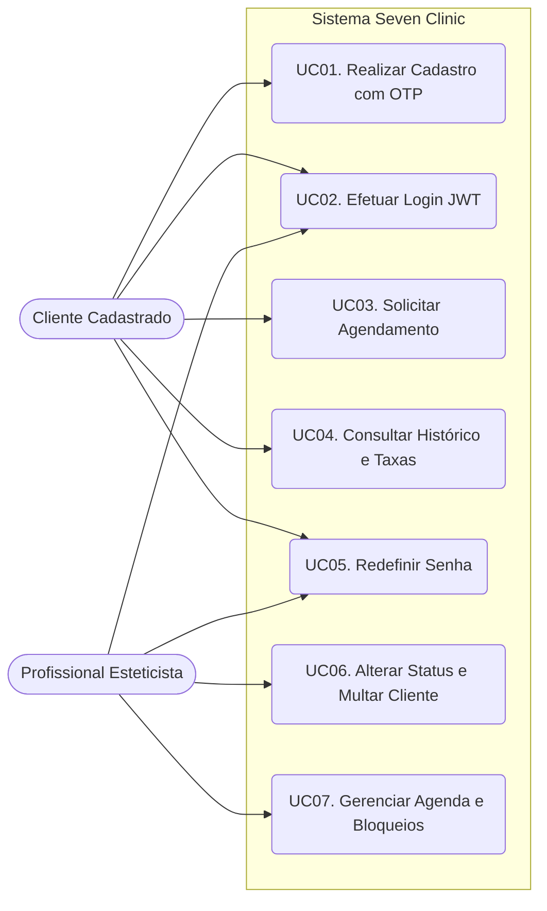
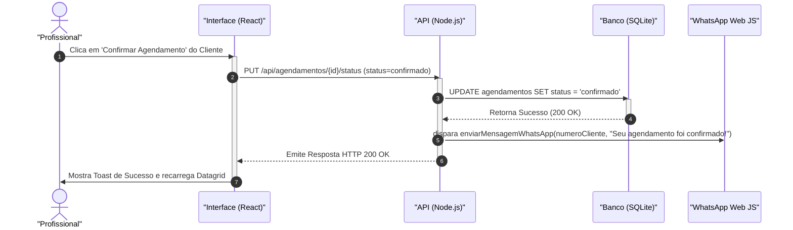
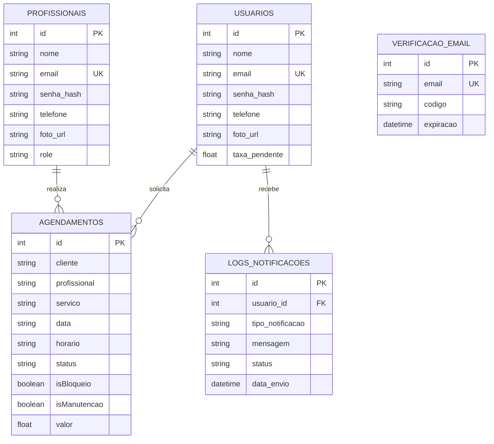

# TRABALHO DE CONCLUSÃO DE CURSO: SISTEMA SEVEN CLINIC

---

## 1. ELEMENTOS PRÉ-TEXTUAIS

*(Nesta seção devem constar as páginas formais de formatação ABNT: Capa, Folha de Rosto, Folha de Aprovação, Dedicatória, Agradecimentos, Epígrafe, Resumo na língua vernácula, Abstract (resumo em língua estrangeira), Lista de Ilustrações, Lista de Tabelas e Sumário. Por se tratar de um documento digital, estas páginas são representadas como marcadores de espaço estruturais).*

---

## 2. INTRODUÇÃO

O mercado de saúde, estética e beleza vem passando por transformações drásticas na última década. Com o aumento da concorrência e o refinamento do comportamento do consumidor, que agora exige comodidade, rapidez e eficiência no atendimento, clínicas e salões de beleza deparam-se com o desafio da digitalização de seus processos gerenciais. É neste cenário de transição tecnológica que se insere o **Seven Clinic**, uma aplicação web robusta, idealizada e desenvolvida para centralizar a gestão de agendamentos e otimizar o relacionamento entre as profissionais de estética e seus clientes.

O objetivo principal deste projeto é prover um ecossistema digital no qual métodos analógicos e manuais — tais como o uso de cadernos de papel, cartilhas físicas de agendamento e anotações isoladas efetuadas por meio de aplicativos de mensagens genéricos (como o WhatsApp) — sejam totalmente substituídos por uma plataforma centralizada, auditável e altamente disponível. 

Através desta aplicação, os clientes conquistam autonomia integral sobre o seu ciclo de atendimento: eles podem realizar seus próprios cadastros, observar o catálogo de serviços detalhado (com preços e durações estipuladas) e, por fim, escolher profissionais e horários que se adequem às suas agendas, de modo independente e inteligente. Em contrapartida, as profissionais e a administração da clínica beneficiam-se de um painel de controle (Dashboard) em tempo real, que mitiga o desgaste operacional, reduz o risco de erro humano (como a sobreposição de horários acidental) e fornece subsídios práticos para a gestão das fichas de anamnese, do fluxo de trabalho diário e do histórico financeiro atrelado aos procedimentos concluídos.

Este documento tem por finalidade detalhar toda a fundação arquitetural, o levantamento de requisitos intrínsecos e extrínsecos, as escolhas de infraestrutura tecnológica, e as modelagens lógicas e de dados que estruturam toda a aplicação Seven Clinic.

---

## 3. ANÁLISE DO SISTEMA ATUAL E JUSTIFICATIVA

Historicamente, o fluxo de operação da grande maioria dos estabelecimentos de estética locais ocorre de maneira manual e altamente reativa. Quando um cliente deseja ser atendido, ele comumente entra em contato via telefone ou aplicativo de mensagens. Este ato exige que haja, do outro lado, uma recepcionista ou a própria profissional interrompendo o seu labor técnico para consultar uma agenda física (ou planilha eletrônica local) em busca de lacunas. 

Este fluxo, além de oneroso do ponto de vista do tempo, gera diversos gargalos operacionais críticos que afetam a lucratividade e a escalabilidade do negócio:

1.  **Conflitos de Agendamento (Double Booking):** A conferência manual frequentemente resulta em *double booking*, onde dois clientes distintos acabam agendados para o exato mesmo slot de tempo com a mesma profissional, gerando desgaste na relação com o consumidor e danos irreparáveis à marca.
2.  **Ruptura Histórica e Perda de Dados Sensíveis:** O registro da evolução dos procedimentos estéticos (prontuários e fichas de anamnese) costuma se perder em fichas de papel rasuradas ou arquivos avulsos. O resgate de informações essenciais (por exemplo, se o cliente demonstrou alergia pregressa a um determinado cosmético) torna-se letárgico e arriscado.
3.  **Dependência Horária:** O negócio fica restrito ao horário comercial. Clientes que tentam agendar horários fora do expediente de atendimento não conseguem realizar a transação de imediato, o que abre margem para a desistência e para a busca na concorrência.
4.  **Ausência de Métricas Financeiras Imediatas:** Consolidar os ganhos e calcular estatísticas de quais serviços possuem a maior saída exige um esforço monumental de tabulação manual ao fim do mês.

A introdução do sistema **Seven Clinic** ataca frontalmente todas estas deficiências, operando de maneira contínua (24 horas por dia, 7 dias por semana) com verificações de integridade diretamente na camada do banco de dados relacional. Assim, todo cliente é capaz de mapear a disponibilidade real da equipe e alocar-se de maneira imediata sem qualquer necessidade de intervenção humana, enquanto a plataforma assegura a exclusividade mútua, notifica automaticamente os clientes via WhatsApp e resguarda perpetuamente os históricos de atendimentos na nuvem.

---

## 4. LEVANTAMENTO DE REQUISITOS

A fase de elicitação de requisitos é o pilar que garante que o software vá suprir fidedignamente as regras de negócio elencadas. 

### 4.1 Requisitos Funcionais (RF)
Os Requisitos Funcionais descrevem pormenorizadamente aquilo que o software tem a obrigação de fazer e as funcionalidades que ele deve ofertar para os seus usuários (atores do sistema).

| ID | Regra de Negócio / Descrição da Funcionalidade | Prioridade |
|:---|:---|:---|
| **RF01** | O sistema deve possuir módulo de cadastramento no qual o interessado fornece nome completo, e-mail único, telefone de contato e senha privada. O e-mail deve ser validado via código OTP enviado via SMTP (Nodemailer). | Alta |
| **RF02** | O sistema deve suportar uma mecânica de autenticação central, provendo o ingresso do usuário apenas mediante validação criptográfica de credenciais (Login via JWT). | Alta |
| **RF03** | O sistema deverá possuir hierarquização através de controle de níveis de acesso. Os usuários deverão ser classificados internamente, no mínimo, em: `cliente` e `profissional`. | Alta |
| **RF04** | A rota pública principal deve dispor o arsenal de serviços do salão ("Cílios", "Unhas", etc.) e um carrossel fotográfico para cativar o usuário. | Média |
| **RF05** | Na área restrita ao cliente logado (`/painel-cliente`), o sistema deverá carregar dinamicamente uma lista temporal contendo o seu retrospecto particular de agendamentos e seu saldo devedor (taxas pendentes). | Alta |
| **RF06** | O cliente deve ter à disposição uma interface interativa para pleitear um novo agendamento, especificando: a modalidade de procedimento pretendido, a data do serviço e o bloco de horário almejado. | Alta |
| **RF07** | O sistema deve validar lógicas de negócios complexas. Por exemplo, para procedimentos específicos (como cílios de longa duração da profissional Laura Alencar), o sistema limitará a 1 agendamento por dia, validará carências para manutenções (exigindo procedimento completo prévio e no máximo 2 manutenções seguidas), e aplicará descontos automáticos (30% antes de 15 dias). | Alta |
| **RF08** | Somente a profissional poderá invocar rotinas de edição de estado no banco de dados para permutar o ciclo de vida do procedimento, transitando-o entre as flutuações de status: *pendente*, *confirmado*, *concluído*, *sugerido*, *recusado* ou *cancelado / não compareceu*. | Alta |
| **RF09** | Em casos de cancelamentos por parte do cliente com menos de 72h de antecedência, ou "não comparecimento" atestado pela profissional, o sistema deve automaticamente gerar e embutir uma taxa punitiva de R$50,00 no perfil do cliente, a ser cobrada no próximo agendamento. | Média |
| **RF10** | O sistema deve enviar notificações ativas e automatizadas diretamente no WhatsApp do cliente e da profissional (utilizando `whatsapp-web.js` + `puppeteer`) informando em tempo real sempre que um agendamento for confirmado, remarcado ou cancelado. | Alta |

### 4.2 Requisitos Não Funcionais (RNF)

| ID | Descrição do Padrão Tecnológico adotado | Restrição |
|:---|:---|:---|
| **RNF01** | **Interface Rica (SPA)**: Desenvolvida sobre a biblioteca **React (versão 19)**, gerenciada pelo bundler Vite, utilizando CSS puro. | Arquitetura |
| **RNF02** | **Responsividade**: Concebido via metodologias *Mobile First* para adaptação em smartphones, tablets e desktops. | Usabilidade |
| **RNF03** | **Comunicação Cliente-Servidor**: Comunicação mediante protocolo HTTP (Rest API), trocando pacotes no formato **JSON**. | Compatibilidade |
| **RNF04** | **Autenticação (JWT)**: Todo acesso restrito deve ser verificado via *JSON Web Tokens*. | Segurança |
| **RNF05** | **Persistência de Transação**: O banco de dados operará baseado na biblioteca motor **SQLite3**, de caráter transacional e relacional. | Armazenagem |
| **RNF06** | **Hashing de Senhas**: As senhas dos usuários deverão ser criptografadas utilizando a biblioteca **Bcrypt.js**. | Segurança |

---

## 5. METODOLOGIA DE CONSTRUÇÃO DA SOLUÇÃO

O **Seven Clinic** adota a orientação a objetos e a separação de responsabilidades em quatro camadas lógicas coesas: **Domínio, Aplicação, Infraestrutura e Interface**, permitindo evolução com baixo acoplamento e alta coesão.

O backend opera em **Node.js (Express)**, operando em sinergia com o frontend em **React 19 (Vite)**. A solução integra componentes de mensageria (WhatsApp) e disparos de e-mail, garantindo um ecossistema de comunicação robusto entre a clínica e o cliente final.

A camada de **Aplicação** está concentrada em `seven-clinic-api/server.js`, que orquestra os casos de uso por meio de rotas e middlewares. O fluxo de autenticação é gerido de forma centralizada, enquanto a lógica de agendamento não apenas valida a disponibilidade de profissionais em tempo real, mas aplica pesadas regras do nicho de estética: validação de histórico do cliente, bloqueio de múltiplas manutenções seguidas e inserção de multas (*no-show fees*) automáticas para clientes que cancelam de última hora.

A **Infraestrutura** implementa a persistência em **SQLite3**, utilizando integridade referencial. A segurança é reforçada pelo uso de **JSON Web Tokens (JWT)** para gestão de sessões e **Bcrypt.js** para proteção de senhas. Adicionalmente, a infraestrutura conta com o **node-cron** para agendamento de tarefas, **Nodemailer** para validações de e-mail com códigos de 6 dígitos e a biblioteca **whatsapp-web.js** para automação de notificações em tempo real.

A **Interface** é dividida entre a API Restful e o frontend em `seven-clinic/src`. A API publica endpoints que gerenciam autorização baseadas em roles. No frontend, foram implementados dashboards protegidos, preservando o estado global da aplicação e garantindo responsividade via CSS puro.

### 5.1 FUNDAMENTAÇÃO TÉCNICA DAS ESCOLHAS

O backend utiliza **Node.js com Express** por sua alta performance em operações assíncronas. A autenticação utiliza armazenamento por hash via **Bcrypt** e emissão de **JWT** com validade temporal (IETF, 2015).

Complementarmente ao núcleo da API, o diferencial do TCC consiste na integração com a biblioteca **whatsapp-web.js** manipulada via **Puppeteer**. Em vez de depender de APIs caras e fechadas (como a API Oficial da Meta), o sistema cria uma sessão local simulando um navegador. Isso permite que a clínica atue como um bot proativo: se a profissional aceita um agendamento, o cliente recebe instantaneamente um *WhatsApp* de confirmação. Se o cliente cancela o agendamento de madrugada, a profissional recebe um *WhatsApp* de alerta para reorganizar sua agenda.

O banco de dados é o **SQLite3**. A escolha do SQLite justifica-se inteiramente pelo escopo arquitetural inicial do projeto: um sistema que visa simplificar a operação de uma clínica sem exigir servidores complexos ou custos com DBaaS (Database as a Service) no primeiro momento (SQLITE, 2025).

---

## 6. DIAGRAMAS DA METODOLOGIA OO

### 6.1 Diagrama de Casos de Uso
O diagrama de *Use Cases* ilustra macroscopicamente as interações inerentes ao sistema operante, circundando quais ações se aplicam aos Atores mapeados.

### 6.2 Especificação de Caso de Uso

**Caso de Uso: UC03 – Solicitar Agendamento**
*   **Ator Primário:** Cliente Cadastrado.
*   **Resumo:** Permite que o cliente logado no sistema selecione um serviço estético, escolha uma data e um horário, e firme o agendamento no banco de dados, estando sujeito às regras de negócio da profissional selecionada.
*   **Fluxo Principal (Happy Path):**
    1. O cliente acessa a rota restrita do seu Painel.
    2. O cliente clica no botão "Novo Agendamento".
    3. O cliente preenche serviço, data e horário e submete o formulário.
    4. O Backend valida as regras de exclusividade e verifica se não há *double booking*.
    5. O Backend aplica regras de negócio adicionais (ex: se for manutenção de cílios, valida se o cliente tem histórico de aplicação completa em menos de 15 dias para conceder desconto).
    6. O Backend checa se o cliente possui taxas pendentes de multas anteriores e as embute no valor final.
    7. O sistema grava o agendamento no banco.
    8. A interface notifica o cliente do sucesso e a API prepara a notificação de WhatsApp.
*   **Fluxo Alternativo (Violação de Regra de Negócio):**
    *   *No passo 5 do fluxo principal*, caso o Backend detecte que o cliente está agendando uma segunda manutenção consecutiva sem uma nova aplicação.
    *   O sistema recusa a gravação e emite um HTTP 400.
    *   A tela exibe a regra da clínica: "Não é permitido realizar mais de 2 manutenções seguidas. Por favor, agende uma nova aplicação."

### 6.3 Diagrama de Sequência
O diagrama de sequência relata a passagem de mensagens cronológicas e os agentes envolvidos para efetivar o agendamento e notificação.

---

## 7. DER PARA O BANCO DE DADOS

O Modelo Entidade-Relacionamento mapeia as representações relacionais estáticas e constrições do banco.

---

## 8. PLANO DE TESTES

1.  **Testagem de Tolerância Concorrente Contra Double-Booking:**
    *   **Cenário:** Dois clientes tentam reservar o mesmo serviço na mesma data e hora.
    *   **Resultado Esperado:** O Backend aborta a segunda transação, emitindo HTTP 400 Bad Request.

2.  **Testagem de Aplicação de Taxa de Ausência (No-Show Fee):**
    *   **Cenário:** A profissional marca um agendamento de um cliente como "Não Compareceu".
    *   **Execução:** O sistema executa a query de atualização do status. Na mesma transação, a trigger da API localiza o `cliente_id` e adiciona `+ 50` à coluna `taxa_pendente` da tabela de Usuários.
    *   **Resultado Esperado:** O cliente recebe uma notificação via WhatsApp informando o ocorrido e o saldo devedor é atualizado para o próximo agendamento ser cobrado automaticamente.

---

## 9. CONCLUSÃO E TRABALHOS FUTUROS

O desenvolvimento do sistema **Seven Clinic** demonstrou de forma contundente a viabilidade da transformação digital no setor de estética e beleza. Ao substituir processos manuais por uma plataforma web centralizada, o projeto atingiu seu objetivo principal: otimizar a gestão de agendamentos com inteligência e robustez.

A adoção de tecnologias modernas como **Node.js, React 19 e SQLite3**, resultou em um sistema altamente responsivo. O grande diferencial da aplicação concentra-se na automação ativa das regras de negócio: a prevenção de conflitos de horário (*double-booking*), a automação de multas por desistências, o cálculo de carências para procedimentos de alta longevidade, e a notificação instantânea via **WhatsApp**.

Como propostas para **trabalhos futuros**, sugere-se a expansão da aplicação mediante a integração com gateways de pagamento online (como PIX via API do Mercado Pago ou Stripe) para liquidação automática das taxas de absenteísmo no momento do agendamento. Adicionalmente, a evolução do bot no WhatsApp poderia permitir que clientes desmarquem ou confirmem horários respondendo "SIM" ou "NÃO" diretamente pelo aplicativo de mensagens, fechando o ecossistema de forma 100% autônoma.

---

## 10. ELEMENTOS PÓS-TEXTUAIS

### 10.1 Referências Bibliográficas

AXIOS. **Axios: Promise based HTTP client**. 2025. Disponível em: https://axios-http.com/. Acesso em: 27 abr. 2026.

EXPRESSJS. **Express - Web framework for Node.js**. 2025. Disponível em: https://expressjs.com/. Acesso em: 27 abr. 2026.

IETF. **RFC 7519: JSON Web Token (JWT)**. 2015. Disponível em: https://datatracker.ietf.org/doc/html/rfc7519. Acesso em: 27 abr. 2026.

META OPEN SOURCE. **React: A JavaScript library**. 2025. Disponível em: https://react.dev/. Acesso em: 27 abr. 2026.

SQLITE. **SQLite: Small. Fast. Reliable.**. 2025. Disponível em: https://www.sqlite.org/index.html. Acesso em: 27 abr. 2026.
